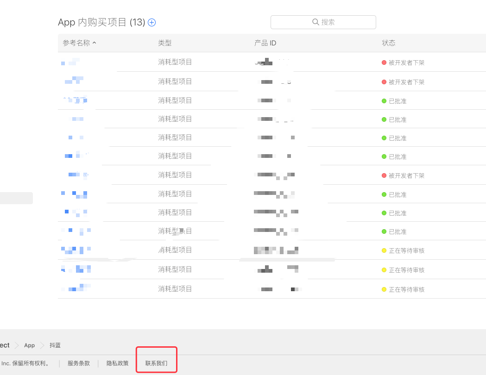
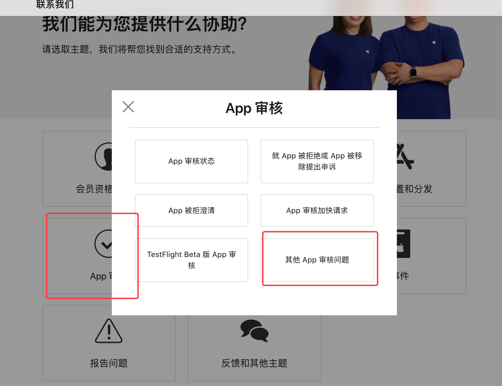
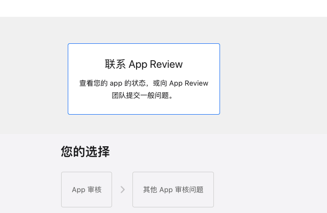
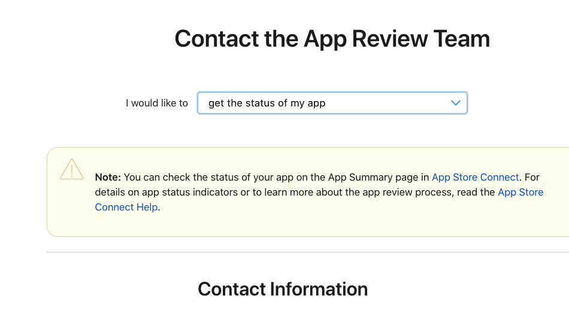

iOS 内购项目 一直处于`正在审核中`

近期应用修改了内购的金额, 新增了几个内购金额, 老样子, 增加了内购金额,等待审核通过就可以发版同步了, 开始等待.
这一等可以要紧, 等了三四天, 一直没有通过, 导致项目的功能无法使用, 开发进度严重落后于安卓的,  特别难受, 就准备记录一下我的解决过程, 希望有用.

1. 查看内购金额有没有提示或者经过, 有的话先把这个处理了, 
2. 开始申请联系申诉, 步骤如下图片显示
3. 联系之后大概几个小时就能批准通过状态(至少我这么经历的), 长的话等个过夜的,
https://developer.apple.com/ 

划重点: 
	1. 如果版本有新增的内购项，特别注意, 一定要内购金额处于`已批准`的状态再去发布版本。
	2. 平时可能用到的金额, 可以提前增加, `已批准`之后在让其处 `准许销售`前面的勾给去掉, 等到需要的时候再打开, 应该是稍等立马就能上线了的呢,

	
